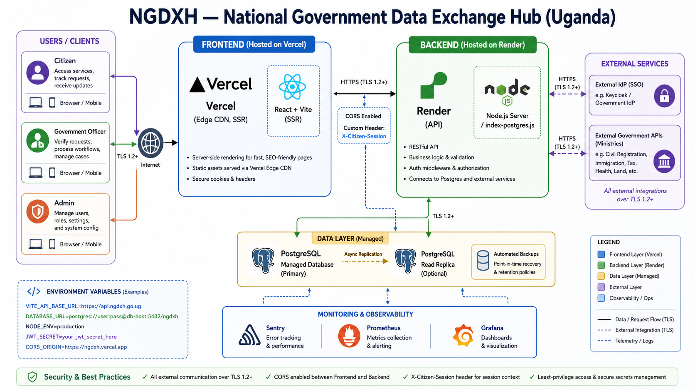
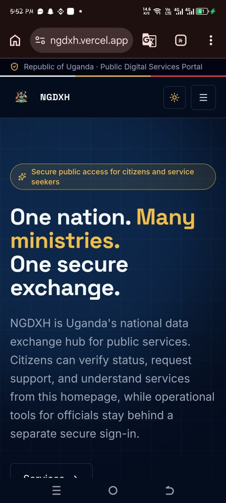
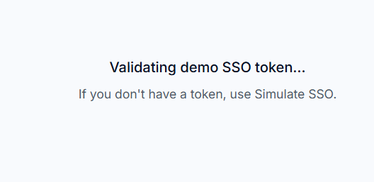
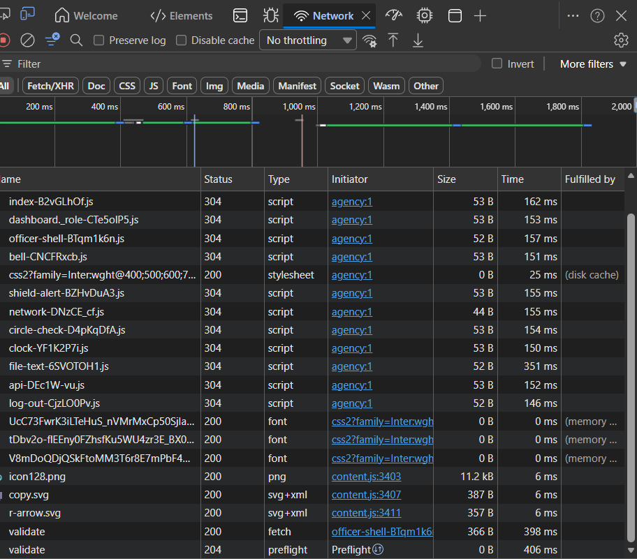

# NGDXH — System Architecture

Author: Ngobi Hussein, Computer Engineer — barakcv.me

Date: 2026-05-30

Version: 1.0

## Executive summary

The National Government Data Exchange Hub (NGDXH) is a secure inter-agency interoperability platform that provides a central hub for authorized government services in Uganda. This document describes the high-level architecture, deployment topology, component responsibilities, data flows, security controls, and operational considerations for the NGDXH demo prototype.

## Images

> Note: Please place the nine images referenced in `docs/images/` with the filenames listed below. Replace filenames if your image names differ.

1. `docs/images/architecture-overview.png` — High-level architecture diagram
2. `docs/images/deployment-topology.png` — Deployment topology diagram
3. `docs/images/devtools-network.png` — DevTools network snapshot
4. `docs/images/landing-mobile-1.png` — Landing page (mobile) screenshot
5. `docs/images/validate-screen.png` — "Validating demo SSO token" screenshot
6. `docs/images/roles-artifact.png` — Roles & Permissions area (artifact example)
7. `docs/images/dashboard-desktop.png` — Officer dashboard (desktop)
8. `docs/images/dashboard-mobile.png` — Officer dashboard (mobile)
9. `docs/images/other-screenshot.png` — Additional screenshot

_(If your images use different names, update the Markdown before converting.)_

## Table of contents

- Executive summary
- Stakeholders
- Architecture diagram
- Component descriptions
- Data flows & APIs
- Authentication & security
- Deployment & operations
- Screenshots
- Appendix

## Stakeholders

- Ministry of ICT & National Guidance (Platform owner)
- Ministry officers (users)
- Citizens (service consumers)
- External ministry APIs (data providers)
- Infrastructure / DevOps teams

## Architecture diagram

Below is the high-level architecture (see image). The diagram shows the Frontend (Vercel with SSR), Backend (Render with Node.js / index-postgres.js), managed Postgres, and external integrations such as IdP and ministry APIs.

## Component descriptions

- Frontend (Vercel): React + Vite with SSR for fast initial render and SEO; Edge CDN for static assets; uses `VITE_API_BASE_URL` to locate backend.
- Backend (Render): Node.js web service exposing REST APIs, SSO simulation endpoints, business logic and validation; connects to Postgres and external ministry APIs.
- Database (Postgres managed): primary writer with optional read replicas, automated backups and PITR.
- Authentication: External IdP (SSO) or simulated SSO for demo; session tokens validated by the backend; header `X-Citizen-Session` used for session propagation.
- Monitoring & Observability: Sentry for errors, Prometheus/Grafana for metrics, Render logs for centralized logs.

## Data flows & APIs

1. Browser → Frontend (HTTPS)
2. Frontend → Backend API (HTTPS) with CORS and `X-Citizen-Session` header
3. Backend → Postgres (TLS) for reads/writes
4. Backend → External ministry APIs (TLS)

Typical API examples:

- `POST /api/sim/sso/login` — demo SSO token issuance
- `GET /api/sim/sso/validate` — validate token and return session
- `POST /api/verify` — cross-ministry verification request

## Authentication & security

- TLS 1.2+ enforced for all external traffic
- Tokens validated on backend; short expiry recommended for production
- Least-privilege access to Postgres and secrets stored in provider secret store
- CORS restricted to frontend origin(s)

## Deployment & operations

- CI/CD: GitHub → Vercel (frontend) and GitHub → Render (backend) with environment secrets
- Backups: automated managed Postgres backups, PITR enabled
- Monitoring: Sentry, Prometheus + Grafana dashboards and alerts

## Screenshots

Place screenshots below with captions. Example:

*Landing page (mobile view).* 

*Validating demo SSO token message.*

*DevTools Network showing script and API requests.*

(Add additional screenshot blocks for the other files you included.)

## Appendix

- System architecture guidance: include any guidance PDF as an appendix (attach the PDF file to the submission bundle).

---

If you confirm these placeholders, I will copy the images into `docs/images/` (you can upload them there) and run Pandoc to produce `NGDXH_System_Architecture.docx`.
